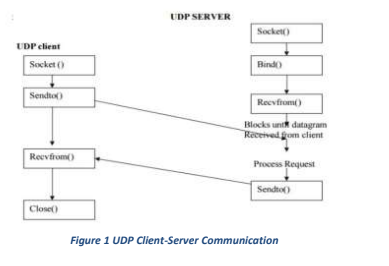

# Assignment 3

# Objective: Create an Echo-Server using UDP socket programming in connection-less.
Echo Server echo back (return back) the message sent by the client. Also, write the Client side program. While creating
program focus on the use of following socket programming functions:
`socket()`, `sockaddr_in`, `bind()`, `sendto()`, `recvfrom()`, `ntohs()`, `ntohl()`.

### Steps to be followed:
#### Server Side:
- Include appropriate header files.
- Create a UDP Socket.
- Create an address by using server’s IP address and server port with `sockaddr_in()`.
- Bind the address and port using `bind()` system call.
- Receive a message from the Client using `recvfrom()` system call.
- Send the received message back(echo) to the client using sendto() system call.
- Close the socket using `close()` system call
#### Client Side:
- Include appropriate header files
- Create a UDP Socket.
- Create an address by using server’s IP address and server port with sockaddr_in().
- Send and receive messages using `sendto()` and `recvfrom()` system call respectively.
- Close the socket using `close()` system call

> Hint: UDP Client-Server Communication Architecture


### Echo Server
  ```c
  /* Copyright 2024 Keys */
  #include <stdio.h>
  #include <stdlib.h>
  #include <string.h>
  #include <arpa/inet.h>
  #include <unistd.h>

  #define PORT 12345
  #define BUFFER_SIZE 1024

  int main() {
      int sockfd, n;
      char buffer[BUFFER_SIZE];
      struct sockaddr_in server_addr, client_addr;
      socklen_t addr_len = sizeof(client_addr);

      sockfd = socket(AF_INET, SOCK_DGRAM, 0);
      if (sockfd < 0) {
          perror("Socket creation failed");
          exit(EXIT_FAILURE);
      }

      // Fill Server information
      memset(&server_addr, 0,  sizeof(server_addr));
      server_addr.sin_family = AF_INET;
      server_addr.sin_addr.s_addr = INADDR_ANY;
      server_addr.sin_port = htons(PORT);

      // Bind the socket with the server address
      if (bind(sockfd, (const struct sockaddr *)&server_addr, sizeof(server_addr)) < 0){
          perror("Binding failed!");
          exit(EXIT_FAILURE);
      }

      printf("Server is listening on %d...\n", PORT);

      while(1) {
          memset(buffer, 0, BUFFER_SIZE);
          n = recvfrom(sockfd, buffer, BUFFER_SIZE, MSG_WAITALL, (struct sockaddr *)&client_addr, &addr_len);
          buffer[n] = '\0';
          printf("Client: %s\n", buffer);

          sendto(sockfd, buffer, n, MSG_CONFIRM, (const struct sockaddr *)&client_addr, addr_len);
          printf("Message echoed back to client.\n");
      }

      close(sockfd);
      return 0;
  }
  ```

### Echo Client
  ```c
  /* Copyright 2024 Keys */
  #include <stdio.h>
  #include <stdlib.h>
  #include <string.h>
  #include <arpa/inet.h>
  #include <unistd.h>

  #define PORT 12345
  #define BUFFER_SIZE 1024

  int main() {
      int sockfd;
      char buffer[BUFFER_SIZE];
      struct sockaddr_in server_addr;
      socklen_t addr_len = sizeof(server_addr);

      sockfd = socket(AF_INET, SOCK_DGRAM, 0);
      if (sockfd < 0) {
          perror("Socket creation failed");
          exit(EXIT_FAILURE);
      }

      memset(&server_addr, 0, sizeof(server_addr));
      server_addr.sin_family = AF_INET;
      server_addr.sin_port = htons(PORT);
      server_addr.sin_addr.s_addr = INADDR_ANY;

      addr_len = sizeof(server_addr);

      while(1){
          memset(buffer, 0, BUFFER_SIZE);
          printf("Enter message: ");
          fgets(buffer, BUFFER_SIZE, stdin);
          buffer[strlen(buffer) - 1] = '\0';

          sendto(sockfd, buffer, strlen(buffer), MSG_CONFIRM, (const struct sockaddr *)&server_addr, addr_len);

          memset(buffer, 0, BUFFER_SIZE);
          recvfrom(sockfd, buffer, BUFFER_SIZE, MSG_WAITALL, (struct sockaddr *)&server_addr, &addr_len);
          printf("Server: %s\n", buffer);
      }

      close(sockfd);
      return 0;
  }
  ```
