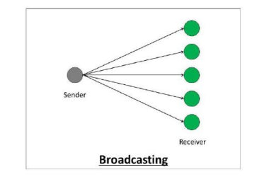

# Assignment 6
## Objective: WAP to implement broadcasting using connectionless socket programming.
Each network segment has a corresponding broadcast address. Take the class C network segment
192.168.1.x as an example, where the smallest address 192.168.1.0 represents the network
segment; and the largest address 192.168.1.255 is the broadcast address in the network segment.
When we want to send a data packet to this address, all hosts on the network segment will receive
and process it. <br>


Note: Broadcast packets are sent and received through UDP sockets.
The broadcast packet sending process is as follows:<br>
a) Create a UDP socket; `socket(AF_INET, SOCK_DGRAM, 0)`<br>
b) Fill the broadcast information structure; `struct sockaddr_in`<br>
c) Set socket options to allow broadcast packets to be sent; `setsockopt(,--- ,SO_BROADCAST,-------)`<br>
d) Send data packet; `sendto()`
### The broadcast packet receiving process is as follows:
a) Create a UDP socket; `socket(AF_INET, SOCK_DGRAM, 0)`<br>
b) Fill the broadcast information structure; `struct sockaddr_in`<br>
c) Bind address and port; `bind()`<br>
d) Receive data packet; `recvfrom()`

### Broadcast Sender
```c
/* Copyright 2024 Keys */
#include <asm-generic/socket.h>
#include <stdio.h>
#include <string.h>
#include <stdlib.h>
#include <arpa/inet.h>
#include <sys/socket.h>
#include <unistd.h>

int main() {
    int sock;
    struct sockaddr_in server;
    int broadcast = 1;
    char *message = "Hello, Broadcast";

    sock = socket(AF_INET, SOCK_DGRAM, 0);
    if (sock < 0 ) {
        perror("Socket creation failed");
        exit(EXIT_FAILURE);
    }

    if (setsockopt(sock, SOL_SOCKET, SO_BROADCAST, &broadcast, sizeof(broadcast)) < 0) {
        perror("Failed to set socket option");
        exit(EXIT_FAILURE);
    }

    memset(&server, 0, sizeof(server));
    server.sin_family = AF_INET;
    server.sin_addr.s_addr = inet_addr("192.168.1.255");
    server.sin_port = htons(12345);

    if (sendto(sock, message, strlen(message), 0, (struct sockaddr *)&server, sizeof(server)) < 0) {
        perror("Failed to send message");
        close(sock);
        exit(EXIT_FAILURE);
    }

    close(sock);
    return 0;
}
```

### Broadcast Reciever
```c
/* Copyright 2024 Keys */
#include <stdio.h>
#include <stdlib.h>
#include <string.h>
#include <unistd.h>
#include <arpa/inet.h>
#include <sys/socket.h>

#define BUFFER_SIZE 1024

int main() {
    int sock;
    struct sockaddr_in recv_addr, cli_addr;
    socklen_t cli_addr_len;
    char buffer[BUFFER_SIZE];

    // Create socket
    sock = socket(AF_INET, SOCK_DGRAM, 0);
    if (sock < 0) {
        perror("Socket creation failed");
        exit(EXIT_FAILURE);
    }

    // Set up the receiver address
    memset(&recv_addr, 0, sizeof(recv_addr));
    recv_addr.sin_family = AF_INET;
    recv_addr.sin_port = htons(12345);
    recv_addr.sin_addr.s_addr = INADDR_ANY;

    // Bind the socket
    if (bind(sock, (struct sockaddr*)&recv_addr, sizeof(recv_addr)) < 0) {
        perror("Binding failed");
        close(sock);
        exit(EXIT_FAILURE);
    }

    printf("Receiver is listening on port 12345...\n");

    // Receive data
    cli_addr_len = sizeof(cli_addr);
    ssize_t recv_len = recvfrom(sock, buffer, BUFFER_SIZE - 1, 0, (struct sockaddr *)&cli_addr, &cli_addr_len);
    if (recv_len < 0) {
        perror("Failed to receive message");
        close(sock);
        exit(EXIT_FAILURE);
    }

    // Null-terminate and print the received message
    buffer[recv_len] = '\n';
    printf("Received Message: %s\n", buffer);

    // Close the socket
    close(sock);
    return 0;
}
```
